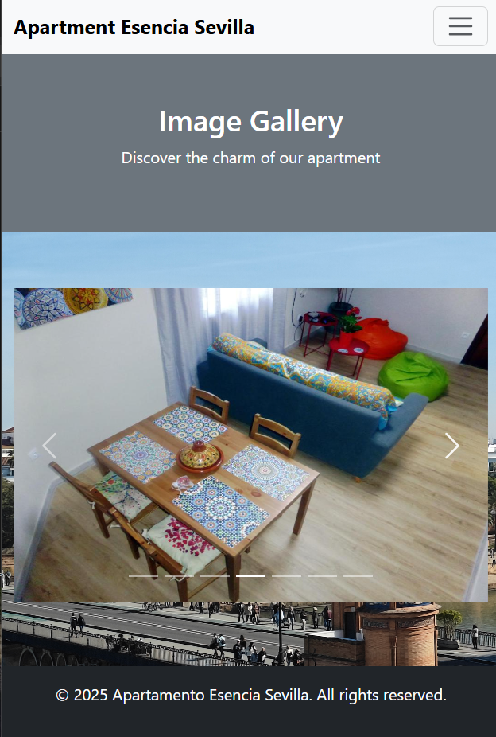

# Memoria del Proyecto “Apartamento Esencia Sevilla”

## 1. Introducción
El presente documento describe el desarrollo de una página web titulada **“Apartamento Esencia Sevilla”**, cuyo objetivo principal es facilitar a los usuarios la reserva de un alojamiento turístico en Sevilla, así como ofrecer información sobre lugares de interés cercanos y funcionalidades complementarias (calendario de disponibilidad, chat IA, etc.).  
El proyecto se ha llevado a cabo empleando exclusivamente **HTML, CSS y JavaScript (con soporte de la librería y framework de Bootstrap 5)** a nivel cliente, cumpliendo así con los requisitos establecidos.

## 2. Descripción General del Proyecto
La página consta de varias secciones (Inicio, Galería, Reservas, Calendario, Ubicación, Sitios de Interés, Mapa Interactivo, etc.), cada una con su propia finalidad:
- **Inicio (`index.html`)**: Presentación inicial del apartamento, con un header destacado que invita a reservar.  
- **Galería (`galeria.html`)**: Muestra un carrusel de imágenes del apartamento.  
- **Reservas (`reservas.html`)**: Contiene un formulario para que el usuario introduzca sus datos personales y de pago.  
- **Calendario (`calendario.html`)**: Visualiza la disponibilidad del apartamento.  
- **Chat IA (`chat.html`)**: Ofrece un chat interactivo donde se puede solicitar información y recomendaciones.  
- **Ubicación (`ubicacion.html`)**: Muestra en un iframe de Google Maps la localización exacta del alojamiento.  
- **Sitios de Interés (`intereses.html`)**: Recopila recomendaciones turísticas, indicando precios y horarios.  
- **Mapa Interactivo (`mapa_interactivo.html`)**: Un mapa de Google Maps con marcadores de puntos relevantes y la posibilidad de mostrar la ruta en autobús desde el apartamento hasta cada sitio.

En conjunto, el proyecto simula ser un sitio web completo y funcional para un alojamiento turístico, **respetando una coherencia de diseño**, un estilo uniforme y **atendiendo requisitos de usabilidad**.

## 3. Estructura de Archivos y Carpetas
La estructura basica del proyecto es:

```
.
├─ index.html
├─ galeria.html
├─ reservas.html
├─ calendario.html
├─ chat.html
├─ ubicacion.html
├─ intereses.html
├─ mapa_interactivo.html
├─ css
│   ├─ bootstrap.min.css
│   └─ styles.css
├─ js
│   ├─ bootstrap.bundle.min.js
│   ├─ translations.js
│   ├─ script.js
│   ├─ chat.js
│   └─ mapa.js
├─ src
│   ├─ gallery/ (imágenes de la galería)
│   ├─ sitiosInteres/ (imágenes de sitios de interés)
│   └─ assets/ (íconos, fondos, etc.)
```

Esta disposición **separa claramente** los ficheros HTML de la hoja de estilos y los scripts, facilitando el mantenimiento.  

- **Captura 1**: Muestra la estructura de carpetas y archivos tal como se ve en el explorador de archivos.


## 4. Tecnologías y Librerías Empleadas

1. **HTML5** y **CSS3**: Para la maquetación y el diseño base.
2. **JavaScript**: Para funcionalidades dinámicas (formulario, chat, mapa, traducciones, etc.).
3. **Bootstrap 5.x**: Para aprovechar componentes, clases y utilidades que agilizan el diseño responsivo.
   - Se ha utilizado la versión `bootstrap.min.css` y `bootstrap.bundle.min.js` (con Popper incluido).
4. **Google Maps API**: Para mostrar el mapa interactivo y la ruta en autobús.
5. **Open IA API:** Para hablar con el asistente virtual.
6. **Marked.js**: Para renderizar texto en Markdown en el chat (`<script src="https://cdn.jsdelivr.net/npm/marked/marked.min.js"></script>`).
 
- **Captura 2**: Muestra la página `index.html` en el navegador.  


## 5. Normativas WCAG Aplicadas
Para cumplir con algunos criterios básicos de **accesibilidad (WCAG)**, se han realizado las siguientes acciones:

1. **Uso de etiquetas `alt`** en las imágenes (por ejemplo, en `galeria.html`, cada `` incluye `alt="..."`).
2. **Uso de textos descriptivos** en botones y enlaces.
3. **Contraste adecuado** entre fondo y texto (se han verificado manualmente los contrastes de color en la medida de lo posible).
4. **Estructura semántica**: se emplean `header`, `nav`, `main`, `section`, `footer`, etc., lo que facilita la navegación por lectores de pantalla.
5. **Labels en formularios**: en `reservas.html` y `chat.html`, cada campo está asociado a su etiqueta.

## 6. Diseño y Códigos de Color
En el fichero `styles.css`, se definen colores para fondo, textos y diferentes clases. Algunos destacados:

- **Color de fondo principal**: `#f2f2f2` (gris claro).
- **Texto**: `#1e1e1e`.
- **Color del navbar activo**: `#0b4fa5`.
- **Colores de disponibilidad**:  
  - Disponible: `#d4edda` (verde claro).  
  - Ocupado: `#f8d7da` (rojo claro).  
- **Mensajes del chat**:  
  - Usuario (fondo azul `#0d6efd`).
  - Respuesta IA (fondo gris `#e9ecef`).

- **Captura 3**: Vista del calendario (`calendario.html`), donde se observa los colores de celdas disponibles/ocupadas.


## 7. Tipografias
Se emplea la tipografía por defecto de *Arial, sans-serif* en `styles.css`. No se han importado Google Fonts adicionales. Esto se hace para garantizar la compatibilidad y simplicidad. En el CSS:

```css
body {
  font-family: Arial, sans-serif;
}
```

## 8. Principales Componentes de Bootstrap Utilizados
Se ha hecho uso de, al menos, 10 componentes/distintos elementos de Bootstrap:

1. **Navbar** (en todas las páginas).
2. **Form** (en `reservas.html` y en el chat).
3. **Carousel** (en `galeria.html`).
4. **Cards** (en `intereses.html` e `index.html`).
5. **Tables** (en `calendario.html`).
6. **Buttons** (en formularios y en el carrusel).
7. **Grid system (row, col)** (distribución de elementos en `index.html`, `intereses.html`, etc.).
8. **Collapse** (en la navbar responsiva).
9. **Input group** (en el chat, para la caja de texto y botón).
10. **Select** (para el conmutador de idiomas `select#languageSwitcher`).

## 9. Explicación de Cada Página y Secciones Principales

### 9.1 Inicio – `index.html`
- Presenta un **header** con un fondo oscuro semi-transparente y un botón que dirige a un servicio de reservas externo.  
- Incluye una **sección de tarjetas (cards)** para describir rápidamente Comodidad, Ubicación y Calendario.

- **Captura 4**: “Vista general de la página de Inicio”.


### 9.2 Galería – `galeria.html`
- Muestra un **carrusel (Carousel)** con varias fotografías del interior del apartamento.  
- Cada foto tiene su texto descriptivo y `alt`.
- **Captura 5**: “Vista general de la página de Galeria”.

### 9.3 Reservas – `reservas.html`
- Contiene un **formulario** con campos de nombre, email, fechas de entrada y salida, número de personas y datos de tarjeta de crédito.  
- Un **botón** final “Pagar y Confirmar Reserva”.  
- Al enviar el formulario, se muestra un `alert(...)` simulado (no hay pasarela de pago real).

- **Captura 6**: Formulario de reservas con todos los campos visibles.


### 9.4 Calendario – `calendario.html`
- Muestra un **calendario en forma de tabla** con celdas de distintos colores según disponibilidad.  
- Al pasar a español / inglés / etc., se traducen los encabezados de la tabla.

- **Captura 7**: Calendario reservas.


### 9.5 Chat IA – `chat.html`
- Permite al usuario escribir mensajes y recibir respuesta de una IA.  
- Emplea JavaScript para llamar a la API de OpenAI (de manera simulada o real, según la configuración).  
- Usa **marked.js** para formatear el texto en Markdown (Puede que no funcione debido a la API).

- **Captura 8**: Conversación de ejemplo en el chat, con el mensaje del usuario y la respuesta de la IA.

### 9.6 Ubicación – `ubicacion.html`
- Insertado un **iframe** de Google Maps con la localización concreta.  
- Se muestra en un contenedor con **clases de Bootstrap** para mantener la proporción 16:9.
- **Captura 9**: Muestra la ubicacion real del apartamento.

### 9.7 Sitios de Interés – `intereses.html`
- Lista lugares turísticos relevantes en Sevilla con **tarjetas (Card)** que incluyen imágenes, precios, horarios y un enlace a Google Maps.  
- Organizado en secciones: “Sitios para Visitar”, “Actividades con Niños”, “Sitios para Comer”, etc.
- **Captura 10**: Muestra los sitios de interes para visitar en Sevilla.

### 9.8 Mapa Interactivo – `mapa_interactivo.html`
- Implementa la carga de un **Google Map** (en `mapa.js`) con marcadores para distintos puntos de interés.  
- Al hacer clic en cada marcador, se muestra la posibilidad de trazar **una ruta en bus** desde el apartamento.
- **Captura 11**: El mapa con varios marcadores desplegados, junto con la información de la ruta en bus.


## 10. Problemas Encontrados y Soluciones
A lo largo del desarrollo surgieron ciertos inconvenientes:

1. **Integración de Google Maps**  
   - El principal reto fue el uso de la API y la configuración de la clave. Se solucionó con la documentación oficial de Google Maps, añadiendo la key en el script.
   
2. **Responsividad del Carrusel y las Imágenes**  
   - Ajustar el tamaño de las imagenes al 100% para diferentes pantallas con las clases de Bootstrap y reglas CSS personalizadas (`.carrusel-responsivo` con `min-height` y `max-height` ajustados).

3. **Traducción Dinámica**  
   - Para no recargar constantemente la página se opto por un script `translations.js` y un `select` para cambiar de idioma, almacenado la preferencia en `localStorage`.

4. **Accesibilidad**  
   - Se ajustaron los contrastes de color y se añadieron textos alternativos.  
   - Se crearon etiquetas `<label>` para formularios, solucionando warnings en validadores HTML.

## 11. Conclusión
Este proyecto demuestra la capacidad de crear un sitio web turístico interativo con **HTML, CSS y JavaScript**, haciendo uso de **Bootstrap 5** y otras librerías de forma eficiente. Aporta funcionalidades prácticas (reservas, calendario, Chat IA, localización en mapa), un diseño responsivo y un mínimo de prácticas de accesibilidad.  
El resultado es una plataforma que **facilita la interacción del usuario** y sirve como punto de partida para implementaciones más avanzadas (pasarelas de pago reales, geston de reservas via base de datos, etc.).

## 12. Bibliografia
- [Enlace github]()
- [Bootstrap Oficial](https://getbootstrap.com/docs/5.3/getting-started/introduction/).  
- [API de Google Maps](https://developers.google.com/maps/documentation)
- [OpenAI API](https://beta.openai.com/docs/).  
- [Documentación MDN de HTML, CSS y JS](https://developer.mozilla.org/).  
- [WCAG 2.1](https://www.w3.org/TR/WCAG21/).  

Todas las imagenes del apartamento y de los lugares de interés son de uso propio o tomadas de bancos de imagenes libres, indicando en cada caso la autoría y con su atributo `alt` correspondiente. Enlaces a Google Maps incluidos en “Sitios de Interés” para mayor detalle.